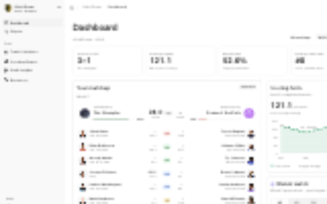
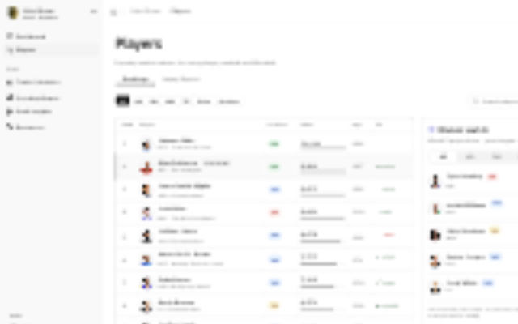
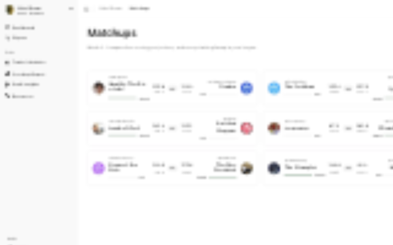
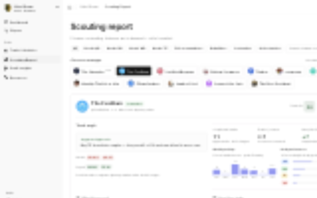

  

  

  

  

  

## Features

- Live matchups, standings, power rankings, playoff odds, and league history
- Player rankings, profiles, projections, injuries, and scouting reports
- Trade analysis powered by RosterAudit
- Dynasty, keeper, and redraft leagues — dynasty pages are priced on the dynasty market, everything else on projected points above replacement
- Username-based league discovery with no manual league IDs
- A sidebar footer link to the project on GitHub

## Data sources

- [Sleeper API](https://docs.sleeper.com/) for players, leagues, rosters, and matchups
- [RosterAudit](https://rosteraudit.com/developers/) for dynasty player values, projections, and trade analysis

## References

- [jhastings843/fantasy-hub](https://github.com/jhastings843/fantasy-hub)
- [kt474/fantasy-football-wrapped](https://github.com/kt474/fantasy-football-wrapped)
- [pseudo-r/Public-ESPN-API](https://github.com/pseudo-r/Public-ESPN-API)
- [akeaswaran/espn-api-docs](https://gist.github.com/akeaswaran/b48b02f1c94f873c6655e7129910fc3b)

## Design system

The UI follows [blasingame.dev foundations](https://components.blasingame.dev/foundations).
See [the implementation guide](docs/design-system.md) for tokens, component sourcing,
and updating the pinned reference. Open `/design-system` for interactive specimens.
